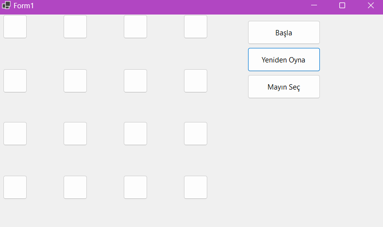

# Mayın Tarlası Oyunu

Bu proje, klasik Mayın Tarlası oyununu temel alan basit bir oyundur. Oyuncunun, mayınlara basmadan tüm güvenli hücreleri açması gerekmektedir.

## Özellikler

- **Oyun Izgarası:** 4x4 boyutunda bir oyun ızgarası.
- **Mayın Yerleştirme:** Oyun başına rastgele olarak 4 mayın yerleştirilir.
- **Zaman Takibi:** Oyunun başlangıcından itibaren geçen süreyi takip eder.
- **Skor Sistemi:** Tamamlanan süreye göre skor hesaplar.
- **Oyun Sonu:** Mayına basıldığında veya tüm güvenli hücreler açıldığında oyun sona erer.
- **Oyun Başlatma ve Sıfırlama:** Oyun başlatma ve sıfırlama butonları ile oyunu kontrol etme.

## Kullanılan Teknolojiler

- C#
- Windows Forms

## Kullanım

1. Projeyi klonlayın veya indirin.
2. Visual Studio veya başka bir C# IDE'si kullanarak projeyi açın.
3. Projeyi derleyin ve çalıştırın.

### Adımlar

1. **Oyunu Başlatma:**
   - "Başlat" butonuna tıklayın.
   - Oyun başlamadan önce tüm hücreler kapalıdır.
   
2. **Hücreyi Açma:**
   - Bir hücreye tıklayarak o hücreyi açın.
   - Eğer hücrede mayın varsa oyun sona erer.
   - Eğer hücrede mayın yoksa, çevresindeki mayın sayısı gösterilir.
   
3. **Oyunu Sıfırlama:**
   - "Yeniden Başlat" butonuna tıklayarak oyunu sıfırlayabilirsiniz.
   - Tüm hücreler kapatılır ve mayınlar yeniden yerleştirilir.
